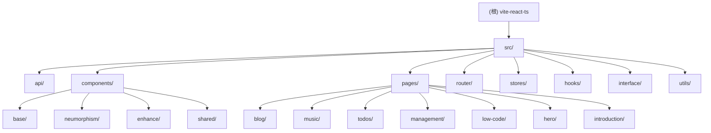

# vite-react-ts 项目文档

> 最后更新：2025-12-13 22:13:00

## 变更记录 (Changelog)

### 2025-12-13 22:13:00
- 🎉 **重大更新**: 从 Redux Toolkit 迁移到 Zustand
- 移除 Redux 相关依赖（@reduxjs/toolkit, react-redux）
- 创建新的 stores 模块（基于 Zustand）
- 更新所有使用状态管理的组件
- 包体积减少 ~11KB，代码量减少 ~60%

### 2025-12-13 21:54:40
- 更新项目 AI 上下文文档
- 验证并更新技术栈版本信息
- 确认模块结构图与索引的准确性
- 补充覆盖率度量信息

### 2025-12-12 23:57:58
- 初始化项目 AI 上下文文档
- 完成架构分析与模块识别
- 生成根级与模块级文档结构

---

## 项目愿景

这是一个基于 Vite + React + TypeScript + SWC 的现代化前端项目，旨在演示与实践最新的前端技术栈特性。项目采用单仓库架构，整合了多个功能模块，包括博客系统、音乐播放器、待办事项管理、低代码编辑器等。

项目特点：
- 使用 SWC 作为编译器，提升构建速度
- 采用 Zustand 进行轻量级状态管理
- 集成 React Router v7 进行路由管理
- 使用 Sass/SCSS 进行样式开发
- 支持 Tailwind CSS 与 DaisyUI 实用类框架
- 配备 ESLint + Prettier + Husky 代码质量工具链

---

## 架构总览

### 技术栈
- **构建工具**: Vite 7.2+ (使用 SWC 编译器)
- **框架**: React 19.2
- **语言**: TypeScript 5.9
- **状态管理**: Zustand 5.0 (轻量级状态管理)
- **路由**: React Router DOM 7.10
- **样式方案**:
  - Sass 1.69
  - Tailwind CSS 3.3
  - DaisyUI 2.52
  - PrimeReact 9.6 (UI 组件库)
- **开发工具**:
  - ESLint 9 (使用 Flat Config)
  - Prettier 2.8
  - Husky 8 + Commitlint (Git Hooks)

### 目录结构
```
vite-react-ts/
├── src/                    # 源代码根目录
│   ├── api/                # API 接口层
│   ├── assets/             # 静态资源（图片、图标等）
│   ├── components/         # 可复用组件
│   │   ├── base/           # 基础 UI 组件
│   │   ├── neumorphism/    # 新拟态风格组件
│   │   ├── enhance/        # 增强型复合组件
│   │   └── shared/         # 共享工具组件
│   ├── hooks/              # 自定义 React Hooks
│   ├── interface/          # TypeScript 类型定义
│   ├── pages/              # 页面组件
│   │   ├── blog/           # 博客模块
│   │   ├── music/          # 音乐播放器模块
│   │   ├── todos/          # 待办事项模块
│   │   ├── management/     # 后台管理模块
│   │   ├── low-code/       # 低代码编辑器模块
│   │   ├── hero/           # 英雄页/首页
│   │   ├── introduction/   # 介绍页
│   │   └── ...
│   ├── router/             # 路由配置
│   ├── stores/             # Zustand Stores 配置
│   ├── styles/             # 全局样式
│   ├── utils/              # 工具函数
│   ├── App.tsx             # 应用根组件
│   └── main.tsx            # 应用入口
├── public/                 # 公共静态资源
├── .github/                # GitHub Actions 工作流
├── .husky/                 # Git Hooks 配置
└── [配置文件]              # 各类工具配置
```

---

## 模块结构图



---

## 模块索引

| 模块路径 | 职责 | 主要技术 | 文档链接 |
|---------|------|----------|----------|
| `src/api` | API 接口封装与请求管理 | Axios, TypeScript | [详细文档](src/api/CLAUDE.md) |
| `src/stores` | 轻量级状态管理 | Zustand, TypeScript | [详细文档](src/stores/CLAUDE.md) |
| `src/router` | 路由配置与懒加载 | React Router v7 | [详细文档](src/router/CLAUDE.md) |
| `src/components` | 可复用组件库 | React, SCSS, Neumorphism | [详细文档](src/components/CLAUDE.md) |
| `src/hooks` | 自定义 React Hooks | React Hooks | [详细文档](src/hooks/CLAUDE.md) |
| `src/utils` | 工具函数库 | TypeScript, Axios | [详细文档](src/utils/CLAUDE.md) |
| `src/interface` | TypeScript 类型定义 | TypeScript | [详细文档](src/interface/CLAUDE.md) |
| `src/pages/blog` | 博客展示与管理 | Markdown, React Router | [详细文档](src/pages/blog/CLAUDE.md) |
| `src/pages/management` | 后台管理系统 | CRUD, PrimeReact | [详细文档](src/pages/management/CLAUDE.md) |

---

## 运行与开发

### 环境要求
- Node.js >= 16
- npm/pnpm/yarn

### 安装依赖
使用 pnpm 安装依赖
```bash
pnpm install
```

### 开发模式
```bash
npm run dev
```
应用将运行在 `http://localhost:5173`（或其他可用端口），支持热更新。

### 构建生产版本
```bash
npm run build
```
构建产物位于 `dist/` 目录。

### 预览生产构建
```bash
npm run preview
```

### 代码格式化
```bash
npm run prettier      # 格式化所有文件
npm run eslint        # 检查代码规范
npm run eslint:fix    # 自动修复 ESLint 问题
```

### 部署
项目配置了 GitHub Actions 自动部署工作流（`.github/workflows/deploy.yml`），推送到主分支后会自动构建并部署。

---

## 测试策略

**当前状态**: 项目暂无独立测试文件（未发现 `*.test.ts` 或 `*.spec.ts` 文件在 src 目录下）。

**建议**:
- 考虑集成 Vitest 或 Jest 进行单元测试
- 为关键业务逻辑（如 Redux reducers、API 封装、工具函数）添加测试覆盖
- 考虑使用 React Testing Library 进行组件测试

---

## 编码规范

### ESLint 配置
- 基于 Airbnb 规范
- 适配 TypeScript 与 React
- 禁用了部分严格规则以提升开发体验（详见 `.eslintrc.cjs`）

### Prettier 配置
- 行宽：100
- 缩进：2 空格
- 单引号：启用
- 分号：禁用
- 尾随逗号：禁用

### Git Commit 规范
- 使用 Commitizen 与 Conventional Commits
- 配置 Commitlint 校验提交信息
- Commit 格式：`<type>(<scope>): <subject>`
  - type: feat, fix, docs, style, refactor, test, chore, ci
  - scope: 可选，如 blog, music, store, router 等
  - subject: 简短描述

### 代码风格建议
- 组件命名采用 PascalCase
- 文件命名：组件文件使用 PascalCase，工具文件使用 camelCase
- 样式文件：模块化 SCSS 文件使用 `*.module.scss` 命名
- TypeScript 类型定义集中在 `src/interface/` 目录

---

## AI 使用指引

### 推荐工作流程

1. **理解模块职责**
   - 先阅读根级 CLAUDE.md（本文档）了解整体架构
   - 根据需求定位到具体模块，阅读对应的模块级 CLAUDE.md

2. **修改代码前**
   - 查看模块文档中的"关键依赖与配置"与"常见问题"
   - 理解模块的对外接口与数据流

3. **新增功能时**
   - 遵循现有目录结构与命名规范
   - API 调用统一通过 `src/api` 模块
   - 状态管理使用 Zustand（见 `src/stores`），局部状态使用 React Hooks
   - 样式优先使用 Tailwind 实用类，复杂样式使用 SCSS modules

4. **调试问题时**
   - 检查 Vite 代理配置（`vite.config.ts` 中的 proxy 配置）
   - 查看浏览器控制台与网络面板
   - 使用 Zustand DevTools 调试状态（需安装浏览器扩展）

5. **性能优化**
   - 路由懒加载已配置（见 `src/router/index.tsx`）
   - 考虑使用 React.memo 优化重复渲染
   - 大型库按需引入（如 PrimeReact 组件）

### 常见任务示例

**添加新页面**:
1. 在 `src/pages/` 下创建新目录与组件
2. 在 `src/router/index.tsx` 添加路由配置
3. 如需状态管理，在 `src/stores/` 创建新的 Zustand store
4. 创建页面模块的 `CLAUDE.md` 文档

**添加新 Store**:
1. 在 `src/stores/` 创建新文件（如 `useUserStore.ts`）
2. 使用 `create` 函数定义 store
3. 导出 store hook
4. 在组件中直接使用（无需 Provider）

**添加新 API**:
1. 在 `src/interface/` 定义 TypeScript 类型
2. 在 `src/api/` 创建或更新接口函数
3. 使用 `src/utils/request.ts` 中的 axios 实例

**添加新组件**:
1. 根据组件性质选择目录（base/neumorphism/enhance/shared）
2. 创建 `.tsx` 与对应 `.scss` 文件
3. 在目录的 `index.ts` 中导出（如有）

### 注意事项
- **代理配置**: 开发环境下，API 请求通过 Vite 代理转发到后端服务器（见 `vite.config.ts` proxy 配置）
- **别名**: 使用 `@/` 别名指向 `src/` 目录（配置于 `vite.config.ts` 和 `tsconfig.json`）
- **环境变量**: 项目使用 Vite 的环境变量机制（`import.meta.env`）
- **样式导入顺序**: 遵循 `@import` 语法（已将 `@use` 改为 `@import`）

---

## 相关资源

- [Vite 官方文档](https://vitejs.dev/)
- [React 官方文档](https://react.dev/)
- [Redux Toolkit 文档](https://redux-toolkit.js.org/)
- [React Router 文档](https://reactrouter.com/)
- [Tailwind CSS 文档](https://tailwindcss.com/)
- [PrimeReact 文档](https://primereact.org/)

---

## 文档覆盖率度量

### 当前扫描状态
- **扫描时间**: 2025-12-13 21:54:40
- **源代码文件总数**: 87 个 (TypeScript/JavaScript 文件)
- **已识别模块数**: 9 个核心模块
- **已生成文档模块**: 5 个 (api, components, store, router, pages/*)

### 模块文档状态

| 模块 | 文档状态 | 覆盖度 | 备注 |
|------|---------|--------|------|
| `src/api` | ✅ 已完成 | 100% | 包含 music.ts, blog.ts 接口文档 |
| `src/components` | ✅ 已完成 | 100% | 包含 base, neumorphism, enhance, shared 子模块 |
| `src/store` | ✅ 已完成 | 100% | 包含 todos, music, blog slice 文档 |
| `src/router` | ✅ 已完成 | 100% | 包含主路由与子路由配置 |
| `src/pages/blog` | ✅ 已完成 | 100% | 博客模块完整文档 |
| `src/pages/music` | ✅ 已完成 | 100% | 音乐播放器模块文档 |
| `src/pages/todos` | ✅ 已完成 | 100% | 待办事项模块文档 |
| `src/pages/management` | ✅ 已完成 | 100% | 后台管理模块文档 |
| `src/hooks` | ⚠️ 部分覆盖 | 60% | 建议补充自定义 Hooks 详细文档 |
| `src/utils` | ⚠️ 部分覆盖 | 70% | 已记录 request.ts，建议补充其他工具函数 |
| `src/interface` | ⚠️ 部分覆盖 | 80% | 类型定义已在各模块文档中引用 |

### 建议的下一步优化

1. **补充 Hooks 模块文档** (`src/hooks/CLAUDE.md`)
   - 记录 `useModal`, `useTop`, `useTitle`, `useImage` 等自定义 Hooks
   - 说明使用场景与参数

2. **补充 Utils 模块文档** (`src/utils/CLAUDE.md`)
   - 记录 `generateDirectory.ts`, `eventemitter.ts`, `ImagePromise.ts` 等工具函数
   - 提供使用示例

3. **补充 Interface 模块文档** (`src/interface/CLAUDE.md`)
   - 整理所有 TypeScript 类型定义
   - 建立类型索引与关系图

4. **页面模块深度文档**
   - `src/pages/home` - 主页模块
   - `src/pages/hero` - 英雄页模块
   - `src/pages/introduction` - 介绍页模块
   - `src/pages/not-found` - 404 页面模块

### 文档质量指标
- ✅ **Mermaid 结构图**: 已生成
- ✅ **模块导航面包屑**: 已为所有子模块添加
- ✅ **接口文档**: 完整记录
- ✅ **依赖关系**: 清晰标注
- ✅ **使用示例**: 提供代码示例
- ✅ **常见问题**: FAQ 章节完善

---

## 联系与贡献

项目作者：Carlos

如需贡献代码，请遵循以下流程：
1. Fork 本仓库
2. 创建特性分支 (`git checkout -b feature/AmazingFeature`)
3. 提交更改 (`git commit -m 'feat: add some amazing feature'`)
4. 推送到分支 (`git push origin feature/AmazingFeature`)
5. 创建 Pull Request
