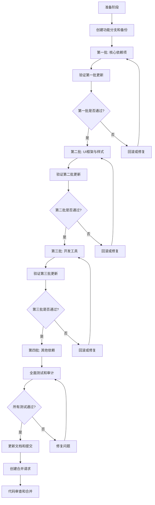

# 依赖项更新实施指南

## 概述

本指南提供了完整的依赖项更新实施方案，包括准备工作、执行步骤、验证流程和风险预案。基于激进的主版本更新策略，我们将分四个批次逐步更新所有依赖项。

## 文档结构

本项目包含以下关键文档：

1. [`dependency-update-plan.md`](./dependency-update-plan.md) - 详细的更新计划和操作指南
2. [`dependency-risk-assessment.md`](./dependency-risk-assessment.md) - 依赖项风险评估和批次计划
3. [`dependency-update-scripts.md`](./dependency-update-scripts.md) - 自动化脚本和工具

## 实施流程图



## 快速开始

### 1. 环境准备

```bash
# 检查当前环境
node --version  # 应为v20.x
pnpm --version

# 确保项目可正常构建
pnpm build

# 运行现有测试
pnpm test
```

### 2. 创建功能分支和备份

```bash
# 创建并切换到新分支
git checkout -b feature/dependency-update-$(date +%Y%m%d)

# 提交当前状态作为备份点
git add .
git commit -m "chore: save current state before dependency update"
git tag -a "pre-update-$(date +%Y%m%d)" -m "State before dependency update"
```

### 3. 使用自动化脚本

从[`dependency-update-scripts.md`](./dependency-update-scripts.md)复制脚本内容，创建`update-dependencies.sh`文件：

```bash
# 创建脚本文件
touch update-dependencies.sh
chmod +x update-dependencies.sh

# 将脚本内容粘贴到文件中

# 执行更新（可选择批次）
./update-dependencies.sh 1  # 只更新第一批
./update-dependencies.sh    # 更新所有批次
```

## 详细执行步骤

### 第一批：核心依赖项更新

**目标**：更新React、TypeScript、Vite等核心依赖项

**手动执行命令**：
```bash
# 更新TypeScript
pnpm update typescript@latest

# 更新Vite及其插件
pnpm update vite@latest @vitejs/plugin-react@latest @vitejs/plugin-react-swc@latest

# 更新构建工具
pnpm update @swc/core@latest

# 更新React生态系统
pnpm update react@latest react-dom@latest @types/react@latest @types/react-dom@latest
```

**验证步骤**：
```bash
# 检查依赖项列表
pnpm list --depth=0

# 运行类型检查
pnpm type-check

# 尝试构建项目
pnpm build

# 启动开发服务器
pnpm dev
```

**常见问题及解决方案**：
- **TypeScript错误**：检查是否有API废弃或类型定义变更
- **Vite配置错误**：检查vite.config.ts是否需要调整
- **React错误**：检查是否有废弃的API或组件使用

### 第二批：UI框架与样式更新

**目标**：更新Tailwind CSS、DaisyUI等UI相关依赖

**手动执行命令**：
```bash
# 更新Tailwind CSS生态系统
pnpm update tailwindcss@latest postcss@latest autoprefixer@latest

# 更新DaisyUI
pnpm update daisyui@latest

# 更新SCSS
pnpm update sass@latest
```

**验证步骤**：
```bash
# 检查样式是否正确加载
pnpm build

# 手动测试UI组件
pnpm dev
```

**常见问题及解决方案**：
- **DaisyUI组件错误**：检查是否有组件API变更
- **样式不生效**：检查CSS类名是否有变化
- **主题问题**：检查自定义主题配置

### 第三批：开发工具更新

**目标**：更新ESLint、Prettier、Husky等开发工具

**手动执行命令**：
```bash
# 更新Prettier
pnpm update prettier@latest eslint-plugin-prettier@latest eslint-config-prettier@latest

# 更新ESLint及其插件
pnpm update eslint@latest eslint-plugin-react@latest eslint-plugin-react-hooks@latest @typescript-eslint/eslint-plugin@latest @typescript-eslint/parser@latest eslint-config-airbnb-typescript@latest

# 更新Husky和commitlint
pnpm update husky@latest @commitlint/cli@latest @commitlint/config-conventional@latest lint-staged@latest
```

**验证步骤**：
```bash
# 运行代码格式化
pnpm lint:fix

# 运行代码检查
pnpm lint

# 测试Git钩子
git commit --allow-empty -m "test: commit message"
```

**常见问题及解决方案**：
- **ESLint配置错误**：可能需要重写配置文件（特别是ESLint 9）
- **Husky钩子失败**：检查钩子脚本权限和路径
- **代码格式化冲突**：调整Prettier和ESLint配置

### 第四批：其他依赖更新

**目标**：更新剩余的功能和工具依赖

**手动执行命令**：
```bash
# 更新剩余依赖
pnpm update @icon-park/react@latest axios@latest react-router-dom@latest react-markdown@latest remark-gfm@latest

# 更新测试相关
pnpm update vitest@latest @vitest/ui@latest @testing-library/react@latest @testing-library/jest-dom@latest jsdom@latest
```

**验证步骤**：
```bash
# 运行完整测试套件
pnpm test

# 构建项目
pnpm build

# 全面功能测试
pnpm dev
```

## 安全审计

```bash
# 运行安全审计
pnpm audit

# 尝试自动修复
pnpm audit fix

# 再次运行审计确认
pnpm audit
```

## 文档更新

### 更新CHANGELOG.md

```markdown
# 依赖项更新日志

## [日期] - 全面依赖项更新

### 核心依赖
- React 18.2.0 → 18.3.1/19.0.0
- TypeScript 5.0.2 → 5.4.5
- Vite 4.4.5 → 5.2.8

### UI框架与样式
- Tailwind CSS 3.3.3 → 3.4.3
- DaisyUI 3.9.4 → 4.7.2

### 开发工具
- ESLint 8.50.0 → 8.57.0
- Prettier 3.0.3 → 3.2.5
- Husky 8.0.3 → 9.0.11

### 破坏性变更及修复
- [列出所有破坏性变更及对应的修复措施]

### 已知问题
- [列出任何已知问题及解决方案]
```

## 提交和合并

```bash
# 添加更改
git add package.json pnpm-lock.yaml CHANGELOG.md

# 提交更改
git commit -m "chore(deps): update all dependencies to latest versions

- Update core dependencies (React, TypeScript, Vite)
- Update UI framework and styling dependencies
- Update development tools and utilities
- Fix compatibility issues and deprecation warnings
- Update CHANGELOG with detailed changes"

# 推送到远程仓库
git push origin feature/dependency-update-$(date +%Y%m%d)

# 创建合并请求
# (通过GitHub/GitLab界面创建)
```

## 回滚计划

如果更新后出现严重问题：

```bash
# 1. 立即停止相关服务

# 2. 回滚到备份标签
git checkout pre-update-$(date +%Y%m%d)

# 3. 恢复lockfile
git checkout HEAD~1 -- pnpm-lock.yaml

# 4. 重新安装依赖
pnpm install --frozen-lockfile

# 5. 重新构建和部署
pnpm build
```

## CI/CD集成

### GitHub Actions更新

在`.github/workflows/deploy.yml`中添加：

```yaml
- name: Check for outdated dependencies
  run: |
    npm i pnpm -g
    pnpm outdated
    pnpm audit --audit-level moderate
```

### Dependabot配置

创建`.github/dependabot.yml`：

```yaml
version: 2
updates:
  - package-ecosystem: "npm"
    directory: "/"
    schedule:
      interval: "weekly"
    open-pull-requests-limit: 5
```

## 后续维护

### 定期检查

1. **每周**：运行`pnpm outdated`检查过期依赖
2. **每月**：运行`pnpm audit`进行安全审计
3. **每季度**：评估并应用主版本更新

### 监控

1. **构建监控**：监控构建过程是否有新错误
2. **性能监控**：监控应用性能是否有下降
3. **错误监控**：监控生产环境是否有新错误

## 联系信息

- **技术负责人**：[联系方式]
- **运维团队**：[联系方式]
- **紧急联系**：[联系方式]

---

**重要提醒**：
1. 在生产环境应用更新前，务必在预发环境进行全面测试
2. 保留所有更新过程中的日志和错误信息
3. 考虑使用功能标志逐步推出重大变更
4. 更新过程中如遇到问题，及时与团队沟通

## 附录：快速命令参考

### 环境检查
```bash
node --version
pnpm --version
pnpm build
pnpm test
```

### 依赖更新
```bash
pnpm outdated
pnpm update package@latest
pnpm audit
pnpm audit fix
```

### 验证测试
```bash
pnpm list --depth=0
pnpm type-check
pnpm lint
pnpm lint:fix
pnpm build
pnpm test
```

### Git操作
```bash
git checkout -b feature/dependency-update-$(date +%Y%m%d)
git add .
git commit -m "chore: save current state before dependency update"
git tag -a "pre-update-$(date +%Y%m%d)" -m "State before dependency update"
git checkout pre-update-$(date +%Y%m%d)  # 回滚