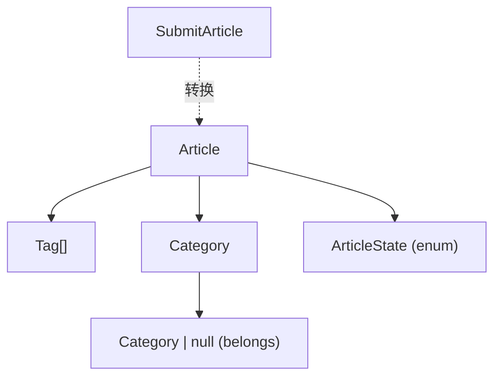

# Interface 模块文档

[根目录](../../CLAUDE.md) > [src](../) > **interface**

> 最后更新：2025-12-13 21:54:40

---

## 模块职责

Interface 模块集中管理项目中使用的 TypeScript 类型定义，提供类型安全保障。主要功能包括：

- 博客系统类型定义（文章、分类、标签）
- 音乐系统类型定义（歌曲、歌单、搜索结果）
- API 响应类型定义
- 通用工具类型

---

## 入口与启动

**主要文件**:
- `blog.ts` - 博客相关类型定义
- `music.ts` - 音乐相关类型定义（如存在）

**使用方式**:
```typescript
import { Article, Tag, Category } from '@/interface/blog'
import { QueryListData, PlaylistItem } from '@/interface/music'
```

---

## 对外接口

### 博客类型定义 (`blog.ts`)

#### ArticleState 枚举
```typescript
export enum ArticleState {
  UN_PUBLISHED,  // 未发布
  PUBLISHED      // 已发布
}
```

**使用示例**:
```typescript
const article: Article = {
  // ...
  state: ArticleState.PUBLISHED
}
```

---

#### Tag 接口
```typescript
export interface Tag {
  id: string       // 标签 ID
  text: string     // 标签文本
  color: string    // 标签颜色（用于 UI 展示）
}
```

**使用场景**:
- 文章标签管理
- 标签筛选与搜索
- 标签云展示

**示例数据**:
```typescript
const tag: Tag = {
  id: '1',
  text: 'React',
  color: '#61dafb'
}
```

---

#### Category 接口
```typescript
export interface Category {
  id: string                  // 分类 ID
  text: string                // 分类名称
  order: number               // 排序顺序
  description: string         // 分类描述
  belongs: Category | null    // 父分类（支持嵌套）
  defaultPoster: string       // 默认封面图
}
```

**特点**:
- 支持嵌套分类（通过 `belongs` 字段）
- 可自定义排序顺序
- 每个分类可设置默认封面图

**使用场景**:
- 文章分类管理
- 分类导航菜单
- 分类筛选

**示例数据**:
```typescript
const category: Category = {
  id: '1',
  text: '前端开发',
  order: 1,
  description: '前端技术相关文章',
  belongs: null,
  defaultPoster: '/images/frontend.jpg'
}

// 嵌套分类
const subCategory: Category = {
  id: '2',
  text: 'React',
  order: 1,
  description: 'React 框架相关',
  belongs: category,  // 父分类
  defaultPoster: '/images/react.jpg'
}
```

---

#### Article 接口
```typescript
export interface Article {
  id: string              // 文章 ID
  title: string           // 文章标题
  tags: Tag[]             // 文章标签（数组）
  category: Category      // 文章分类
  state: ArticleState     // 发布状态
  content: string         // 文章内容（Markdown）
  description: string     // 文章摘要
  poster?: string         // 文章封面图（可选）
  updateAt: string        // 更新时间
  createAt: string        // 创建时间
}
```

**使用场景**:
- 文章列表展示
- 文章详情页
- 文章编辑表单

**示例数据**:
```typescript
const article: Article = {
  id: '1',
  title: 'React 19 新特性解析',
  tags: [
    { id: '1', text: 'React', color: '#61dafb' },
    { id: '2', text: 'JavaScript', color: '#f7df1e' }
  ],
  category: {
    id: '1',
    text: '前端开发',
    order: 1,
    description: '前端技术',
    belongs: null,
    defaultPoster: '/images/frontend.jpg'
  },
  state: ArticleState.PUBLISHED,
  content: '# React 19 新特性\n\n...',
  description: '本文介绍 React 19 的主要新特性',
  poster: '/images/react19.jpg',
  updateAt: '2025-12-13T21:54:40Z',
  createAt: '2025-12-01T10:00:00Z'
}
```

---

#### SubmitArticle 类型
```typescript
export type SubmitArticle = Omit<Article, 'tags' | 'category'> & {
  tags: string[]      // 标签 ID 数组
  category: string    // 分类 ID
}
```

**用途**: 用于文章提交表单，将对象类型转换为 ID 字符串

**使用场景**:
- 文章创建/编辑表单提交
- API 请求参数

**示例**:
```typescript
const submitData: SubmitArticle = {
  id: '1',
  title: 'React 19 新特性解析',
  tags: ['1', '2'],           // 标签 ID 数组
  category: '1',              // 分类 ID
  state: ArticleState.PUBLISHED,
  content: '# React 19 新特性\n\n...',
  description: '本文介绍 React 19 的主要新特性',
  poster: '/images/react19.jpg',
  updateAt: '2025-12-13T21:54:40Z',
  createAt: '2025-12-01T10:00:00Z'
}

// 提交到 API
await ArticleApi.add(submitData)
```

---

### 音乐类型定义 (`music.ts`)

**注**: 音乐相关类型定义详见 `src/api/CLAUDE.md` 中的"数据模型"章节。

主要类型包括：
- `QueryListData` - 搜索结果单曲信息
- `QueryNewSongReturnData` - 新歌推荐数据
- `PlaylistTag` - 歌单标签
- `PlaylistItem` - 歌单列表项
- `BannerInfo` - 轮播图信息
- `PlaylistTrack` - 歌单曲目详情
- `PlaylistDetailData` - 歌单详情

---

## 关键依赖与配置

### 依赖项
- `typescript` 5.9 - TypeScript 编译器

### 类型导出规范
- 使用 `export interface` 导出接口
- 使用 `export type` 导出类型别名
- 使用 `export enum` 导出枚举

### 命名规范
- 接口名使用 PascalCase（如 `Article`, `Tag`）
- 枚举名使用 PascalCase（如 `ArticleState`）
- 类型别名使用 PascalCase（如 `SubmitArticle`）

---

## 数据模型关系图



---

## 测试与质量

**当前状态**: 无独立测试文件。

**建议**:
- 使用 TypeScript 编译器进行类型检查
- 编写类型测试（使用 `tsd` 或 `expect-type`）
- 确保类型定义与后端 API 响应一致

---

## 常见问题 (FAQ)

### Q1: 为什么 Category 的 belongs 字段是 Category | null？
**A**: 支持嵌套分类结构。根分类的 `belongs` 为 `null`，子分类的 `belongs` 指向父分类。

### Q2: SubmitArticle 与 Article 的区别是什么？
**A**: `SubmitArticle` 用于表单提交，将 `tags` 和 `category` 从对象转换为 ID 字符串，便于 API 传输。

### Q3: 如何添加新的类型定义？
**A**:
1. 在 `src/interface/` 创建新文件（如 `user.ts`）
2. 定义接口或类型别名
3. 使用 `export` 导出
4. 在需要的地方导入使用

### Q4: 为什么使用 enum 而不是 union type？
**A**: `enum` 提供了更好的语义化和自动补全支持。对于固定的状态值（如 `ArticleState`），使用 `enum` 更合适。

### Q5: 如何确保类型定义与后端一致？
**A**:
- 使用 OpenAPI/Swagger 生成类型定义
- 定期与后端同步 API 文档
- 编写集成测试验证类型正确性

---

## 相关文件清单

```
src/interface/
├── blog.ts            # 博客相关类型定义
└── music.ts           # 音乐相关类型定义（如存在）
```

---

## 变更记录 (Changelog)

### 2025-12-13 21:54:40
- 初始化 Interface 模块文档
- 记录博客系统所有类型定义
- 补充类型关系图与使用示例
